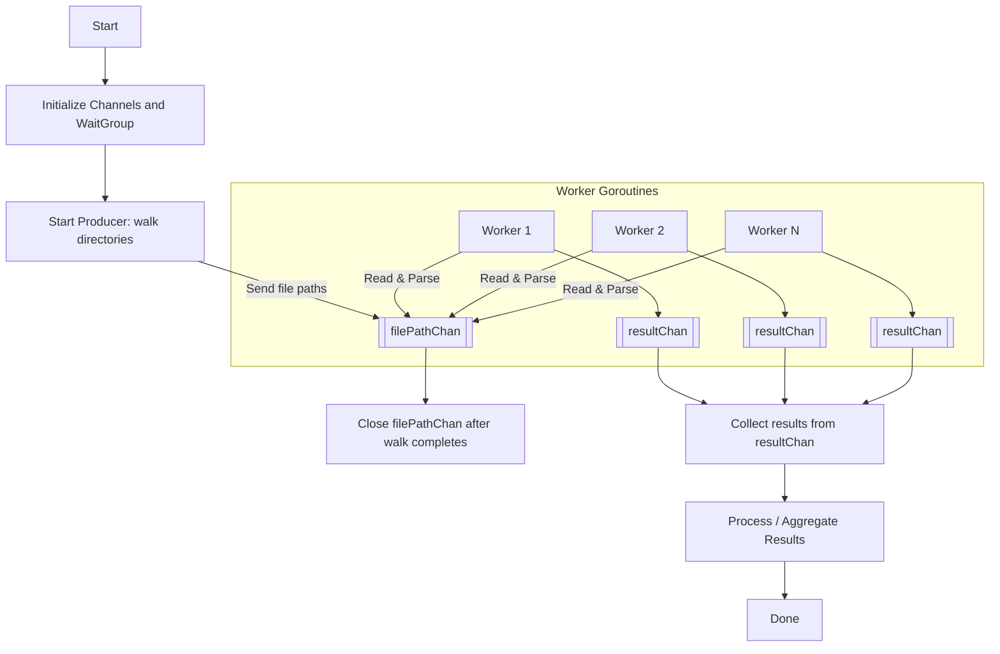

# Architecture decision records

An [architecture
decision](https://cloud.google.com/architecture/architecture-decision-records)
is a software design choice that evaluates:

- a functional requirement (features).
- a non-functional requirement (technologies, methodologies, libraries).

The purpose is to understand the reasons behind the current architecture, so
they can be carried-on or re-visited in the future.

## Problem Specification: CLI Tool to Scan Multiple Projects for Dependencies

**Objective**  
Create a command-line tool in Go that scans multiple project directories (recursively) to identify supported dependency files (e.g., `package.json` for Node.js, `pubspec.yaml` for Dart), extracts all declared dependencies with their versions and categories (e.g., dev, prod), and returns a detailed list along with the file path where each dependency was found. The tool must support mixed environments and ecosystems in a single scan.

**Use Cases**

- Scanning multiple directories (e.g., `./apps`, `./libs`) that include both Dart and Node.js projects to produce a unified list of dependencies.
- Running the tool across a monorepo that contains heterogeneous project types and aggregating all dependencies into a single report.
- Identifying dependency reuse across projects regardless of version differences.
- Exporting all dependency data to a JSON or CSV file for auditing or documentation.
- Using the aggregation option to count how often a dependency appears and determine the range of versions used.

**Edge Cases**

- Projects that contain both `package.json` and `pubspec.yaml` in the same directory.
- Nested project folders with their own dependency files.
- Mixed ecosystem files that declare the same dependency name with different versioning schemes.
- Invalid or empty dependency files.
- Missing or malformed version constraints.
- Dependency categories that differ slightly by ecosystem (e.g., `devDependencies` in Node.js vs `dev_dependencies` in Dart).

**Limits and Exclusions**

- The CLI should not perform installation, validation, or resolution of dependencies.
- It should not attempt to interpret or align versioning schemes across ecosystems.
- It should not support additional ecosystems (e.g., Go) unless explicitly added later.
- It should not require any configuration file; functionality is entirely controlled via CLI flags and arguments.

**Output Options**

- Display results in the console in a readable tabular format.
- Export results in JSON or optionally CSV, with structured entries: dependency name, version, type (dev, prod, etc.), file path.
- Support an `--aggregate` flag to summarize dependency occurrences across projects and show min/max version where applicable.

**CLI Syntax Requirements**

- Follows conventions similar to tools like `scc`, `fd`, or `ripgrep`.
- Accepts one or more directory paths to scan.
- Supports `--json`, `--csv`, and `--aggregate` flags.
- Supports filtering by ecosystem with `--include=node,dart`.

## Possible architectures

**Common Core Requirements (for all architectures)**

- Recursive directory walking
- File type detection (by name or extension)
- Parsing JSON or YAML files
- Error handling (missing files, malformed content, etc.)

### Sequential Walker with File Type Switch

**Description**: Walk each directory recursively using `filepath.WalkDir`, and sequentially check each file. If it's a supported dependency file, open it and decode its content (JSON/YAML).

- **Concurrency**: ❌ None
- **Ease of implementation**: ✅ Easiest
- **Performance**: 🚫 Slower on large codebases
- **Pros**: Simple, easy to debug, minimal complexity
- **Cons**: Doesn’t scale well for large trees

### Concurrent File Processing with Goroutines + Worker Pool

**Description**: Use `filepath.WalkDir` to collect file paths first, then process each supported file concurrently via a worker pool (e.g., 4-8 workers).

- **Concurrency**: ✅ Controlled via workers
- **Ease of implementation**: 🟡 Moderate
- **Performance**: ⚡️ Good on multi-core machines
- **Pros**: Balanced control over concurrency; scales well
- **Cons**: Slightly more boilerplate (channels, goroutines, waitgroups)

### Fully Concurrent Walker with Parallel File Handling

**Description**: As you traverse the directories, launch a goroutine for each dependency file you encounter (maybe limit goroutine count using a semaphore to avoid exhaustion).

- **Concurrency**: ✅ Maximum
- **Ease of implementation**: 🔴 Harder
- **Performance**: ⚡️⚡️ Very high on SSDs and multi-core
- **Pros**: Fastest approach
- **Cons**: Harder to manage (synchronization, errors, goroutine leak risk)

### Channel-based Producer/Consumer Pattern

**Description**:

- **Producer**: Walks directories, finds relevant files, and sends them over a channel
- **Consumers**: Read from channel and parse files in parallel

- **Concurrency**: ✅ Cleanly structured
- **Ease of implementation**: 🟡 Moderate (cleaner than raw goroutines)
- **Performance**: ⚡️ Good
- **Pros**: Scalable and maintainable, good balance of structure and speed
- **Cons**: Slightly more setup than sequential approach

### MapReduce-style Fan-Out / Fan-In Model

**Description**:

- Fan out directory walking across top-level directories
- Each goroutine processes a subtree
- Results are collected via channels and aggregated

- **Concurrency**: ✅ High
- **Ease of implementation**: 🔴 Most complex
- **Performance**: ⚡️⚡️ High
- **Pros**: Highly parallel, ideal for large project trees
- **Cons**: Overhead of coordinating goroutines and merging results

### Summary Table

| Architecture                             | Ease of Implementation | Performance      | Concurrency | Recommended Use Case                      |
| ---------------------------------------- | ---------------------- | ---------------- | ----------- | ----------------------------------------- |
| 1. Sequential                            | ✅ Easiest             | 🚫 Low           | ❌ None     | Small projects or prototypes              |
| 2. Worker Pool                           | 🟡 Medium              | ⚡️ Good         | ✅ Yes      | Balanced performance, simple to scale     |
| 3. Fully Concurrent (Goroutine per file) | 🔴 Hard                | ⚡️⚡️ Very High | ✅✅ Yes    | Max performance, large project sets       |
| 4. Channel-based Producer/Consumer       | 🟡 Medium              | ⚡️ Good         | ✅ Yes      | Clean concurrency for medium-large sets   |
| 5. Fan-Out / Fan-In (MapReduce-ish)      | 🔴 Hardest             | ⚡️⚡️ Very High | ✅✅ Yes    | Best for large, nested project structures |

## Steps for Producer/Consumer Architecture in Go

**Setup**

- Define a list of supported dependency files (e.g., `package.json`, `requirements.txt`, etc.)
- Create a struct to hold file data or errors

**Channels**

- Create a channel to send found file paths (`filePathChan`)
- Create a channel to send parsed results (`resultChan`)

**Producer (Directory Walker)**

- Recursively walk directories using `filepath.WalkDir`
- If a supported file is found, send its path into `filePathChan`

**Consumers (Workers)**

- Spawn N workers (goroutines)
- Each reads from `filePathChan`, opens & parses file (JSON or YAML), sends result to `resultChan`

**Result Collector**

- Read from `resultChan` and handle parsed data (e.g., store, print, or aggregate)

**Cleanup**

- Close channels properly (once walking is done and workers have exited)
- Use `sync.WaitGroup` to coordinate worker completion

**Mermaid Diagram**

